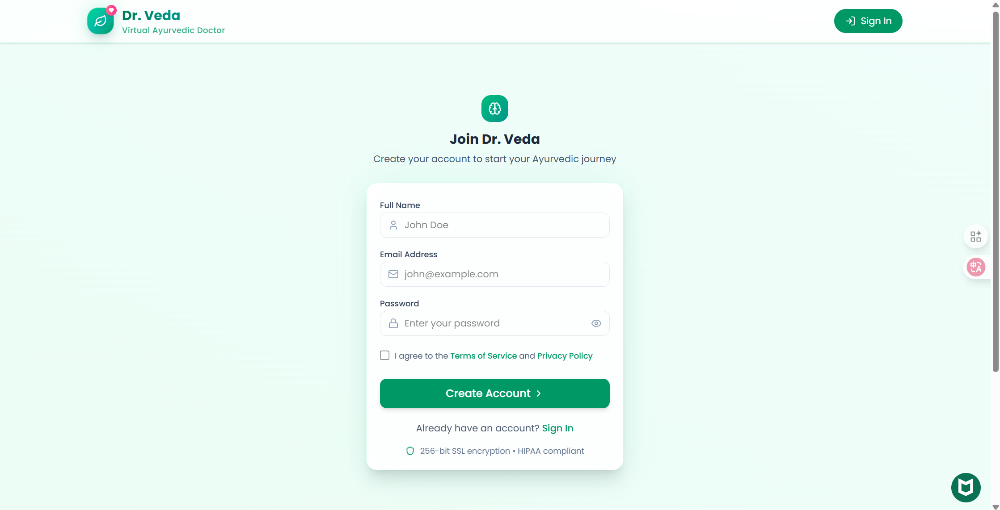
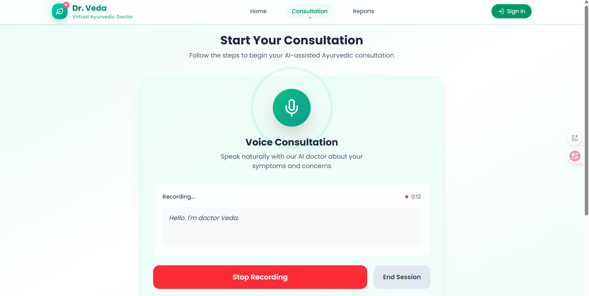
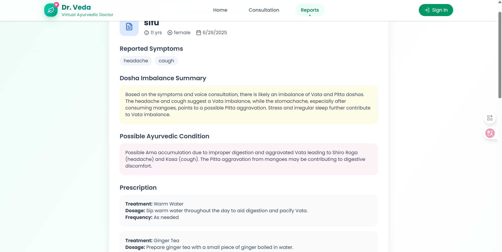
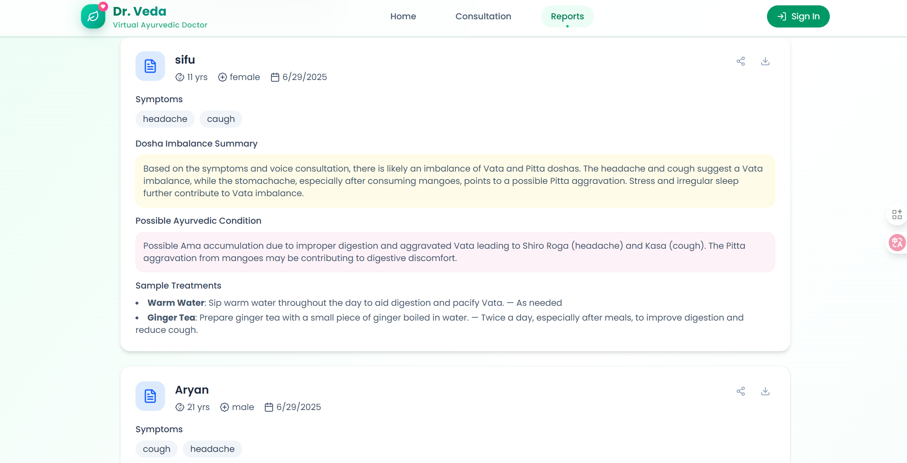

# 🩺 Dr. Veda – AI-Powered Doctor Consultation

Dr. Veda is an AI-powered voice consultation app that allows users to speak naturally about their health concerns. It transcribes the conversation, analyzes symptoms using Google Gemini, generates Ayurvedic reports, and presents a clean consultation history UI with downloadable results.

## ✨ Features

- 🎙️ **Voice Consultation with AI** using Vapi SDK
- 🧠 **Automatic Transcription & Gemini Report Generation**
- 🪔 **Ayurvedic Analysis**: Dosha imbalance, conditions, and treatments
- 🗂️ **Consultation History** with filters, duration, symptoms, and more
- 📥 **Share & Download** reports directly from the dashboard
- 🔁 **Real-time Updates** on speech activity and timer
- 🌐 **Next.js App Router + TailwindCSS + TypeScript**

## 🚀 Demo

🌍 **[Live Demo]((https://dr-veda.vercel.app/))**

## 📸 Screenshots

| Authentication | Voice Consultation |
|---------------|-------------------|
|  |  |

| Report Generation | Report History |
|-------------------|----------------|
|  |  |

## 🧩 Tech Stack

| Technology | Description |
|-----------|-------------|
| **Next.js 14** | App Router, SSR, Optimized routing |
| **Tailwind CSS** | Utility-first, responsive styling |
| **TypeScript** | Strict types and interfaces |
| **Vapi SDK** | Voice agent integration (WebRTC) |
| **Google Gemini API** | Health diagnosis & summarization |
| **Firebase Firestore** | Real-time transcription logging |
| **Lucide Icons** | Iconography across UI |

## 📁 Project Structure

```bash
/components
  /ui               → Shared UI like LoadingSpinner
  ConsultationHistory.tsx
  VoiceConsultation.tsx
/pages
  /reports/[id]     → Dynamic report viewer
/lib
  /actions          → API + Gemini integration
  vapi.sdk.ts       → Vapi Web SDK instance
```

## 🛠️ Setup Instructions

### 1. Clone the Repository

```bash
git clone https://github.com/your-username/dr-veda.git
cd dr-veda
```

### 2. Install Dependencies

```bash
npm install
# or
yarn install
```

### 3. Setup Environment Variables

Create a `.env.local` file in the root:

```bash
NEXT_PUBLIC_VAPI_WORKFLOW_ID=your_vapi_workflow_id
NEXT_PUBLIC_VAPI_PUBLIC_KEY=your_vapi_public_key
GOOGLE_API_KEY=your_google_gemini_key
FIREBASE_API_KEY=xxxxxx
FIREBASE_PROJECT_ID=xxxxxx
FIREBASE_APP_ID=xxxxxx
```

🔐 **Don't commit this file** — it's ignored via `.gitignore`.

### 4. Run the Dev Server

```bash
npm run dev
# or
yarn dev
```

App will be available at [http://localhost:3000](http://localhost:3000)

## 🧠 How It Works

1. **User clicks Start Consultation** → triggers Vapi call
2. **Vapi transcribes live speech** → text is stored via `appendTranscription()`
3. **When the call ends:**
   - It triggers Gemini API to summarize health issues
   - Generates a personalized Ayurvedic report
   - Final report is saved via `finalizeReport()`
4. **User is redirected** to `/reports/[slug]` to view it

## 📦 Deploying on Vercel

Click below to deploy instantly:

[](https://vercel.com/new/clone?repository-url=https://github.com/your-username/dr-veda)

## 📌 Roadmap

- ✅ Voice consultation with transcription
- ✅ Ayurvedic analysis using Gemini
- ✅ Report generation + download
- ⏳ Authentication & user history sync
- ⏳ Mobile UI improvements
- ⏳ Admin dashboard for monitoring

## 🙏 Acknowledgments

- [Vapi.ai](https://vapi.ai) for the voice agent SDK
- [Gemini API](https://ai.google.dev/) by Google
- [Tailwind UI](https://tailwindui.com/) inspiration

## 📃 License

MIT License. Feel free to fork, extend, and contribute!

## ✉️ Contact

Have feedback, feature requests, or want to contribute?

- 📧 **Email**: zunxii.2210@gmail.com
  
